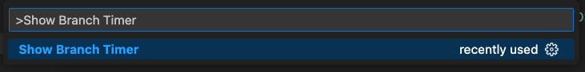

# branch-timer README

## Features

Extension for track your work duration on every branch

- For show Timer :

  

- Control timer from status bar :

  

- Copy Duration with branch:

  

- Show branchs timers on sidebar with possibility to copy duration and refresh it:

  

- Show branches & duration percents on pie chart and select current branch:

  
## Release Notes

## v0.0.1

- Show branch timer
- Control timer from status bar
- Click on duration for copy it with branch

## v0.0.2

- Changed saved json directory And Added to .gitignore

## v0.0.3

- Auto enable extension
- Avoid duplicated add json file to gitignore

## v0.0.4

- Stop timer when vscode unfocused

## v0.1.0

- Added sidebar view show :
  - Branch name
  - Branch duration
  - duration percentage
  - Copy & refresh buttons

## v0.1.1

- Minor updates on texts

## v0.1.2

- Sort branches by long duration

## v0.1.4

- Create .vscode folder if not exisT
- Fixed timer issue

## v0.1.5

- Added pie chart to sidebar view

## v0.1.7

- Fixed branch undefined issue
- Colored current branch

## v.1.8
- Added autoAddToGitIgnore configuration for control add branch timer json to gitignore

---
