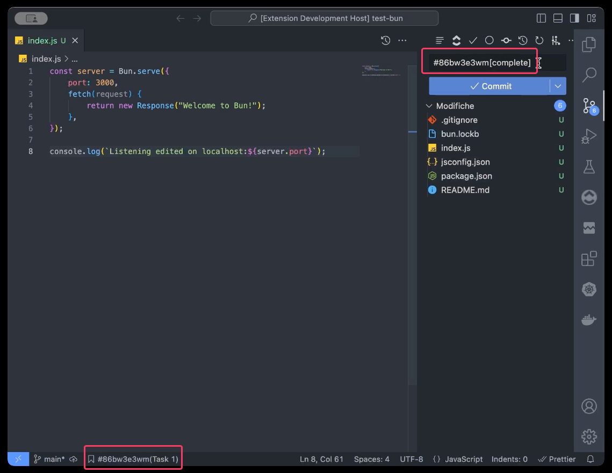

<h1 align='center'>
Unofficial <a href="http://clickup.com">ClickUp</a> VSCode extension

[](https://www.gnu.org/licenses/agpl-3.0)


</h1>

## Requirements

You need to have a ClickUp token to interact with your private task, use [official guide](https://docs.clickup.com/en/articles/1367130-getting-started-with-the-clickup-api) to create one

## Install
Use command:

```
ext install edsol.clickup
```

or find it in [marketpace](https://marketplace.visualstudio.com/items?itemName=edsol.clickup)

## Features

* Show and edit task inside a List and Space
* Create new task inside a List
* Change task status via commit message


## "Working on" Mode

Through the menu in the Status Bar you can now select a task you are working on, once you have finished your changes you can change its status through the commit message.

Watch the video below :arrow_down:

[](./docs/status_changer.mp4)

## Extension Commands
This extension contributes the following commands:
* `clickup:refresh`: reload and update data of TreeView
* `clickup:setToken`: set personal token
* `clickup:deleteToken`: delete personal token 

All other commands can be used only via GUI (for now)

## Roadmap

- [x] Task counter badge
- [ ] Easy way to edit status outside edit mode
- [ ] Manage via global settings
- [ ] Increase performaces
- [ ] Add filters and groupings
- [ ] Implements time tracking
- [x] Add and delete list insde a space
- [x] Create and delete spaces
- [x] Refresh TreeView button 
- [x] Collapse TreeView button
- [x] Create new List
- [x] load task informations in real time 

## Release Notes
Detailed Release Notes are available [here](CHANGELOG.md)
