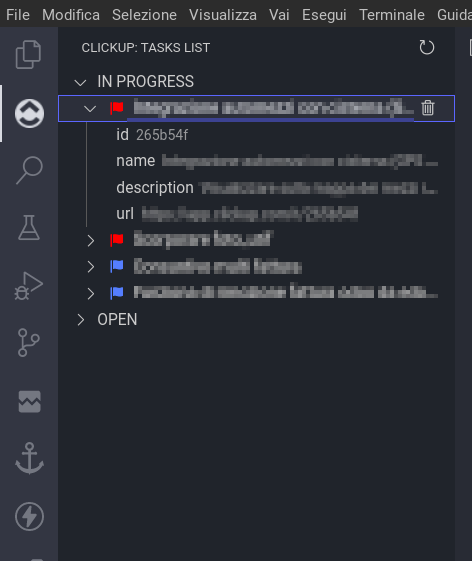

# ClickUp README

Integrates clickup and its workflows into vscode

## Features

## Requirements

The only requirement you need is a [ClickUp account](http://clickup.com)

## Extension Settings

At the first startup it is necessary to enter the access token

## Release Notes

### 0.0.2

* Group tasks by status
* Added Flags for priority level system (Urgent, High, Normal, Low).
* Show task details (you can choose which fields to display, for now only by code).

### 0.0.1

Initial release