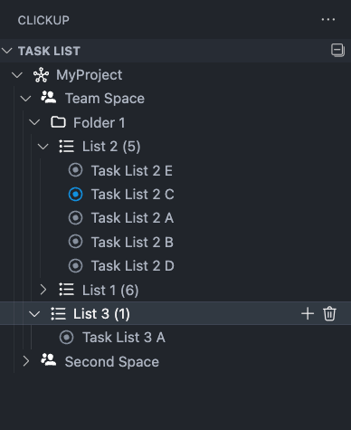
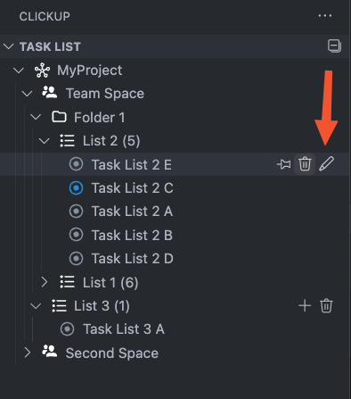
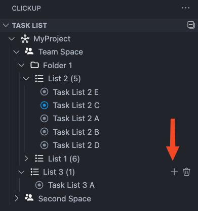

# 🔗 Unofficial [ClickUp](https://clickup.com) Extension for VSCode

[](https://www.gnu.org/licenses/agpl-3.0)
[](https://marketplace.visualstudio.com/items?itemName=edsol.clickup)

---

## 📋 Requirements

To interact with your private tasks, you need a **ClickUp API token**.  
Follow the [official guide](https://docs.clickup.com/en/articles/1367130-getting-started-with-the-clickup-api) to generate one.

---

## 🚀 Installation

Use the command palette:

```bash
ext install edsol.clickup
```

Or search for it in the [Visual Studio Marketplace](https://marketplace.visualstudio.com/items?itemName=edsol.clickup).

---

## ⚙️ Initialization

Use the following commands to manage your ClickUp API token:

- `ClickUp: Set token`
- `ClickUp: Show token`
- `ClickUp: Delete token`

---

## ✨ Features

### 📁 Task Explorer

View your tasks organized by lists, folders, and spaces.



### 🛠️ Task Actions

Edit, delete, or work on a task directly from VSCode.



### ➕ Create New Task

Quickly add new tasks to any list.



### 💼 “Working on” Mode

Select a task you're currently working on from the status bar. Once you're done, you can update its status automatically through a Git commit message.

Usage preview:


You can also select a task manually from the list:


### 📝 Task Status via Commit

Update task status directly from your commit message.

1. Select a task:  
   

2. Choose a new status:  
   

3. Write and push your commit:  
   

### 😋 My Task Section

Thanks to [@HeIIow2](https://github.com/HeIIow2), a new section lists all tasks assigned to you:


### ⏱️ Time Tracker

Track your time spent on tasks and view summaries by user.

> **Note**: Time tracking is enabled by default and can be disabled from the extension settings.


### 🧩 New Interface, Comments & Subtasks

A refreshed UI is now available for a more intuitive task experience.

#### 💬 Comment Section

Easily view and add comments to tasks directly inside VSCode. Improve your collaboration without switching contexts.


#### 🧷 Subtasks Management

Visualize and manage subtasks in a clear and structured way. Create, complete or delete subtasks in just a few clicks.


#### 🎨 Updated Interface

We've modernized the layout and enhanced readability, so working with your ClickUp tasks feels more native and integrated into the VSCode environment.


---

## ⚙️ Configuration

Go to:  
`Settings → Extensions → ClickUp`  
and customize the extension to your needs.

---

## 🗺️ Roadmap

- [x] Task counter badge
- [x] Status editing outside edit mode
- [x] Global settings management
- [ ] Improve performance
- [ ] Add filters and groupings
- [x] Time tracking
- [x] Add/delete lists in spaces
- [x] Create/delete spaces
- [x] Refresh TreeView button
- [x] Collapse TreeView button
- [x] Create new list
- [x] Live task info loading
- [x] i18n support
- [x] “My Task” section
- [x] Official icons
- [x] Comments
- [x] Subtasks

---

## 🌐 Translation

Currently supports **English** and **Italian** 🇮🇹.  
Help translate to your language — it’s easy!

1. Duplicate `package.nls.json` and rename it as `package.nls.<lang>.json`
2. Duplicate `bundle.l10n.json` from the `i18n` folder and rename it to `bundle.l10n.<lang>.json` (e.g., `bundle.l10n.es.json` for Spanish)

---

## 📦 Release Notes

See [CHANGELOG.md](CHANGELOG.md) for detailed release history.

---

## ☕ Support My Work

If you enjoy the extension and want to support its development:

<a href="https://www.buymeacoffee.com/edsol" target="_blank">
  
</a>

---

## 🙏 Special Thanks

### 💻 Code Contributors

- [@definiteIymaybe](https://github.com/definiteIymaybe)
- [@ILoomans](https://github.com/ILoomans)
- [@M97Chahboun](https://github.com/M97Chahboun)

### ☕ Caffeine Supporters

- [@gute1](https://github.com/gute1)
